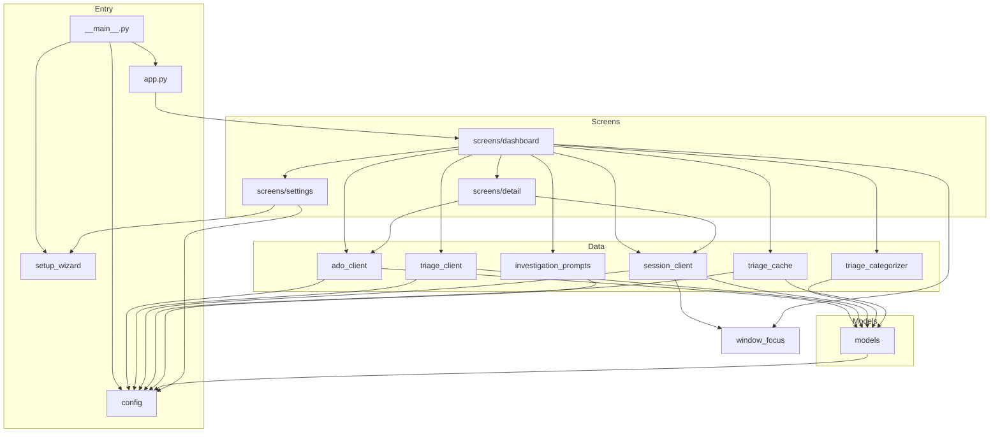

# Architecture

ADO Dashboard is a [Textual](https://textual.textualize.io/) TUI. The only runtime dependency is `textual>=3.0.0`; all Azure DevOps communication is via the `az` CLI subprocess. There is no HTTP library in the package.

---

## Module Map

```
src/ado_dashboard/
├── __main__.py          Entry point: arg parsing, setup wizard, config loading, app launch
├── app.py               WipDashboardApp — theme, CSS path, root screen push
├── config.py            Config module globals, 4-layer resolution helpers, URL helpers
├── models.py            Pure dataclasses: PullRequest, WorkItem, TriageItem, CopilotSession + helpers
├── setup_wizard.py      CLI-mode interactive wizard; config file I/O via platformdirs
│
├── screens/
│   ├── dashboard.py     DashboardScreen — 5-tab layout, all data loading workers, AI enrichment
│   ├── detail.py        DetailScreen — single-item view (PR / WI / Triage / Session)
│   └── settings.py      SettingsScreen — config form, model/agent discovery, board list editor
│
├── ado_client.py        Async wrapper around `az repos` / `az boards` CLI commands
├── triage_client.py     Async runner for Get-TriageItems.ps1; JSON extraction
├── triage_categorizer.py Pure-function rule-based categorizer + AI result merger
├── triage_cache.py      File-based cache for AI triage JSON (~/.ado-dashboard/triage/)
├── session_client.py    Scan ~/.copilot/session-state/; launch/resume sessions in Windows Terminal
├── investigation_prompts.py  Prompt builders for Copilot investigation sessions
├── window_focus.py      Win32 ctypes window-focus by PID ancestor chain
│
├── scripts/
│   └── Get-TriageItems.ps1  PowerShell triage data fetcher (bundled)
└── styles/
    └── app.tcss         Textual CSS — palette variables + widget rules
```

---

## Module Dependency Diagram



---

## Async Model

### Worker pattern

Long-running work uses Textual's `@work` decorator. Workers run on the asyncio event loop inside Textual's executor — the UI thread is never blocked.

| Worker | Decorator args | What it does |
|--------|----------------|--------------|
| `DashboardScreen._load_data` | `@work(exclusive=True)` | Stage-1: fetch My PRs first; Stage-2: parallel gather for Reviewing, WIs, Triage, Copilot Sessions |
| `DashboardScreen._refresh_triage` | `@work(exclusive=True, group="triage-fetch")` | Re-fetch single board on dropdown change |
| `DashboardScreen._start_copilot_triage` | `@work(exclusive=True, group="copilot-triage")` | Launch AI triage or apply cached results |
| `DetailScreen._load_detail` (inferred) | `@work` | Fetch full PR/WI detail in background |

### subprocess calls

All external processes use `asyncio.create_subprocess_exec` (non-blocking):

| Caller | Command |
|--------|---------|
| `ado_client._run_az` | `az <subcommand> --output json` |
| `triage_client.fetch_triage_items` | `pwsh -File Get-TriageItems.ps1 ...` |
| `session_client._get_active_session_pids` | `pwsh -Command (CIM-based PS script)` |

`session_client.resume_session` and `session_client.launch_investigation` use `subprocess.Popen` (fire-and-forget, intentional).

### AI enrichment polling

After a Copilot triage session is launched, `DashboardScreen` sets a `set_interval(4, _poll_copilot_triage)` timer. The timer reads the cache file mtime every 4 seconds, stops when the file is newer than the launch timestamp (or after a 5-minute timeout), then calls `apply_ai_analysis` and re-renders the triage tab.

---

## Screen Lifecycle

```
WipDashboardApp.on_mount
  └─ push_screen(DashboardScreen)
       ├─ compose()        → Header + TabbedContent(5 panes) + Input + Static + Footer
       ├─ on_mount()       → _setup_columns() + _load_data() [worker]
       └─ key bindings
            ├─ Enter       → push_screen(DetailScreen(selected_item))
            ├─ s           → push_screen(SettingsScreen)
            │    └─ pop on save/cancel → DashboardScreen.on_settings_closed
            ├─ Escape       → DetailScreen.action_go_back → pop_screen()
            └─ q           → App.action_quit
```

Settings returns `Screen[bool]` — `True` on save, `False` on cancel.

---

## Where State Lives

| State | Location |
|-------|----------|
| Loaded PR / WI / triage / session lists | `DashboardScreen` instance attributes (`_my_prs`, `_work_items`, etc.) |
| Filtered (search) copies | `_all_*` instance attributes; filtered view in `_*_prs` etc. |
| Selected triage board | `DashboardScreen._selected_board`; also written back to `config.TRIAGE_BOARD` on change |
| Sort state per table | `DashboardScreen._sort_state` dict keyed by table widget ID |
| Triage priority groups | `DashboardScreen._triage_groups` dict `{priority: [TriageItem]}` |
| AI enrichment status | `_ai_triage_status`, `_ai_action_plan`, timer handle, launch time |
| Config (runtime) | Module globals in `ado_dashboard.config` — mutated by `load_from_file` / `apply_overrides` / `SettingsScreen.action_save` |
| Config (persistent) | `platformdirs.user_config_path("ado-dashboard") / "config.json"` |
| AI triage cache | `~/.ado-dashboard/triage/<board_key>.json` |
| Session state (read-only) | `~/.copilot/session-state/<uuid>/workspace.yaml` + `events.jsonl` |
| Debug log | `<repo-root>/ado-dashboard.log` (overwritten each run) |
